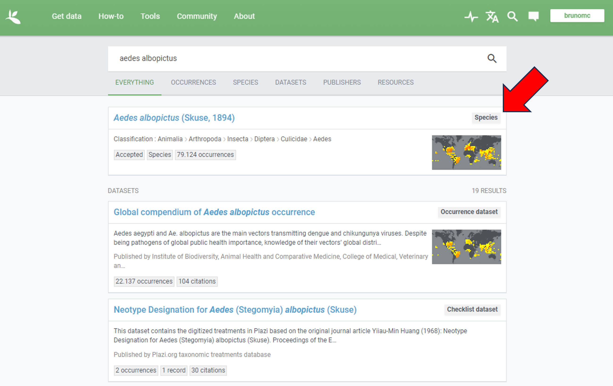
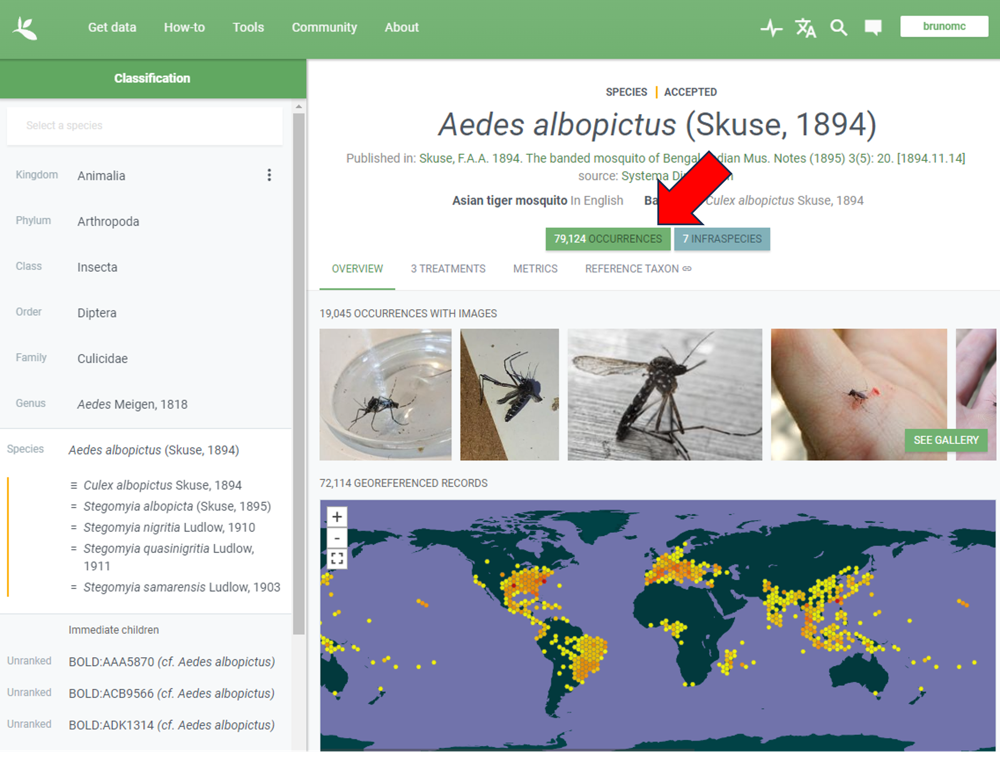
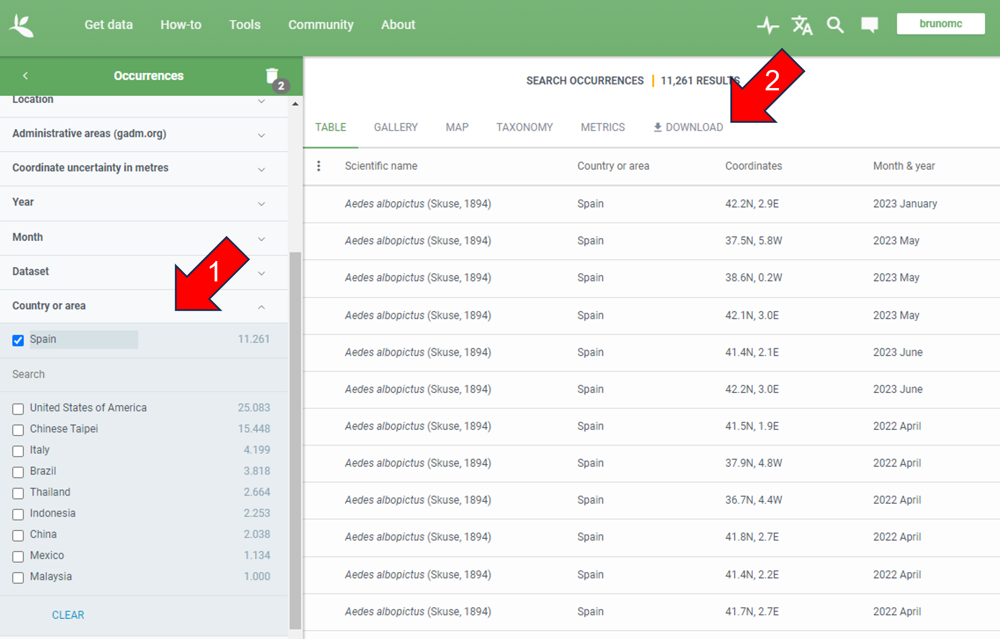
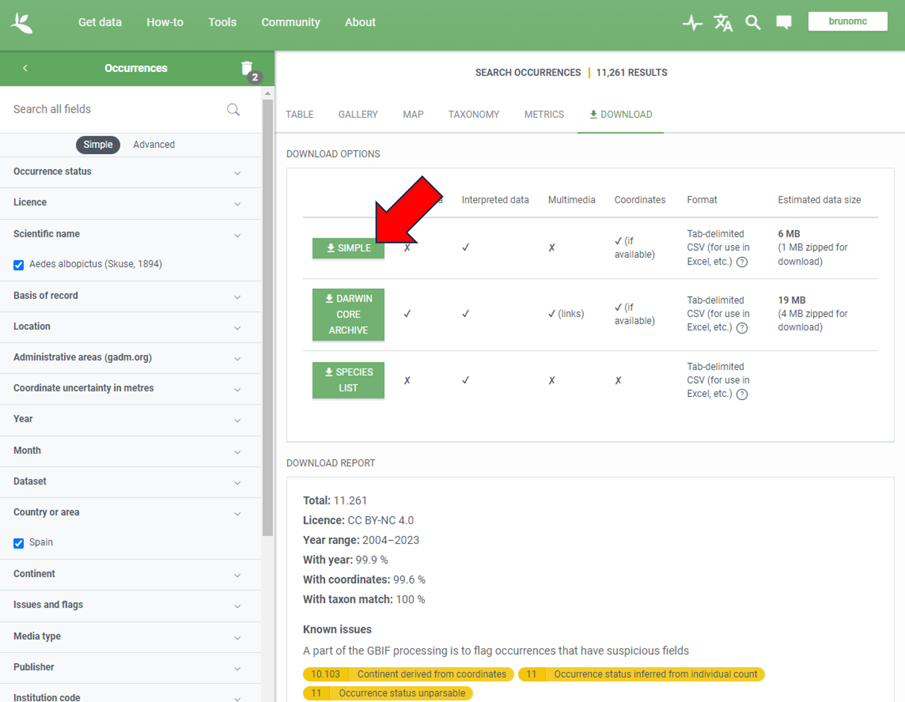
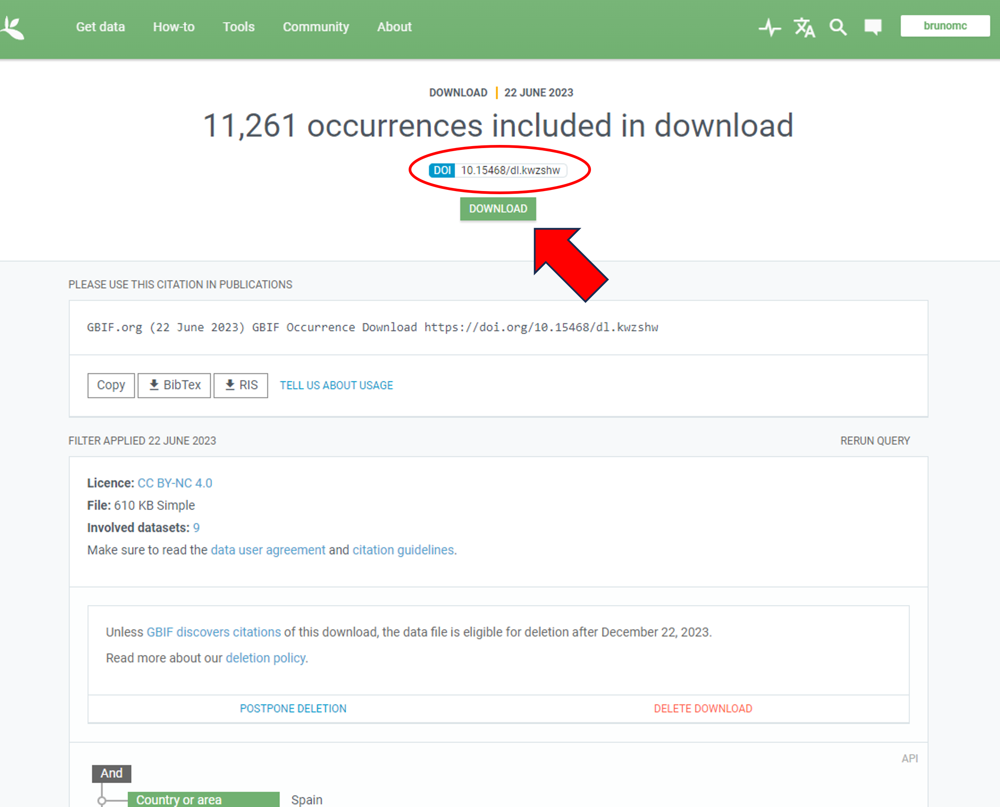

# A brief tutorial on Ecological Niche Modelling

Bruno M. Carvalho

e-mail: [brunomc.eco@gmail.com](mailto:brunomc.eco@gmail.com)

ORCID: [0000-0002-0009-5770](https://orcid.org/0000-0002-0009-5770)

Last reviewed on: July 2023

</br>

The objective of this short tutorial is to run ecological niche models aimed at predicting the climatic suitability of a given species in a given country. We will be running three types of models: a climate envelope (bioclim), a statistical method (logistic regression), and a machine learning method (random forest). You can optionally run a maxent model, but it requires additional instalation steps that are described below. 

Before running the scripts, you are encouraged to choose a species and a country to run the models, and download data from the [GBIF](https://www.gbif.org/) by following the steps below. If you want to skip this, you can use the example data for _Aedes albopictus_ in Spain, which is available at the data folder.

The tutorial is divided in three scripts, that should be run in the following order:

1. R/00_GHR_tutorial_gbif.R: Explore the species records and clean the database that was previously downloaded from GBIF.

2. R/01_data_harmonization.R: Prepare the climate variables, sample pseudoasences, and harmonize a single table for modelling.

3. R/02_modelling.R: Run the ecological niche models, evaluate against out-of-sample data, and map predictions.

</br>

### Required R packages

- [CoordinateCleaner](https://cran.r-project.org/package=CoordinateCleaner)
- [leaflet](https://CRAN.R-project.org/package=leaflet)
- [sf](https://cran.r-project.org/package=sf)
- [raster](https://cran.r-project.org/package=raster)
- [dismo](https://cran.r-project.org/package=dismo)
- [randomForest](https://cran.r-project.org/package=randomForest)
- [readr](https://cran.r-project.org/package=readr)
- [dplyr](https://cran.r-project.org/package=dplyr)

Note: In linux machines you might need to install the gdal library from the terminal before installing the R packages. To do that, type the following in the terminal:

```{bash}
sudo apt install libgdal-dev
```

Run the following R code to install all required packages from CRAN:

```{r}
install.packages(c("sf", "raster", "dismo", "randomForest", "readr", "dplyr"))
```

Optional steps, for running maxent models:

- Install [dismo](https://cran.r-project.org/package=dismo) and [java](https://www.java.com/)
- Make sure that java, R, and your OS are all either 32-bit or 64-bit
- Download maxent from [this page](https://biodiversityinformatics.amnh.org/open_source/maxent/)
- Move the maxent.jar file into the java folder of the dismo package. If you can't find this folder on your local machine, run the following on R:

```{r}
system.file("java", package = "dismo")
```
</br>

### Before running the scripts

1. Choose a species and country that you want to use in this tutorial ([Google](https://www.google.com/) can help)

2. Navigate to [GBIF](https://www.gbif.org/) and register a username and password

3. Login and use the search engine to find the records for your chosen species:



</br>

4. Open the occurrence dataset:



</br>

5. Filter results to your chosen country and go to the download page:



</br>

6. Download as a simple csv file:



</br>

Accept the Terms of Responsibility and proceed. Wait some minutes until the data finishes processing.  

You will receive an automatic email from GBIF when the data is ready for download. At this point, your dataset has a unique DOI which you can use to cite and re-download the data if you need it.  

When the data is ready for download, you can click on the button to download it:



</br>

7. Unzip the downloaded csv file and move it to the folder "data/gbif/yourspeciesdata.csv"

8. You are ready to run the first script of this tutorial! You can find them in the "R" folder.

</br>

### Data in this repo

- Species occurrence records: Aedes albopictus in Spain ([GBIF](https://www.gbif.org/))
- World country borders ([Esri](https://hub.arcgis.com/datasets/esri::world-countries-generalized/about))
- Bioclimatic indicators, averaged for 1970-2000, resolution 10 minutes (~340 km2) ([WorldClim](https://www.worldclim.org/)):
  - Annual mean temperature (bio01)
  - Temperature seasonality (bio04)
  - Annual precipitation (bio12)
  - Precipitation seasonality (bio15)

</br>
